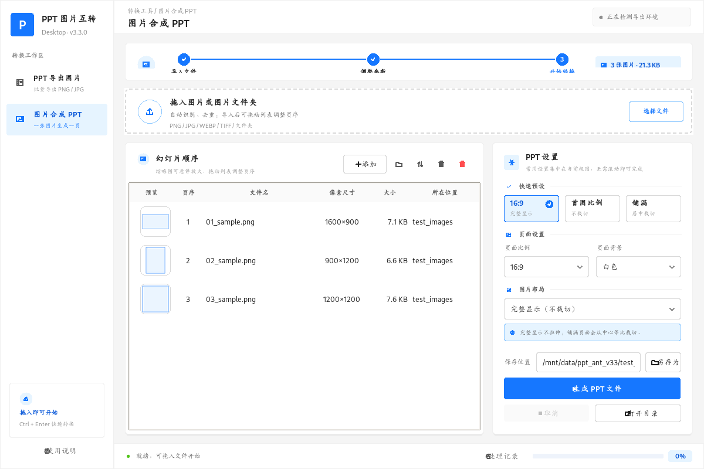
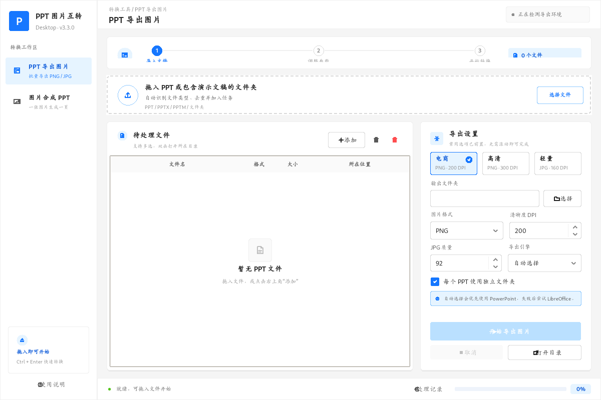

# PPT 图片互转工具

> 一个面向 Windows 的桌面工具：批量将 PPT/PPTX 导出为图片，或将多张图片按顺序合成为 PPTX。




## 为什么值得用

- 双向转换：PPT/PPTX 批量导出 PNG/JPG；图片批量合成 PPTX。
- 拖放导入：文件或文件夹直接拖入窗口，自动识别、去重。
- 更省心的导出：优先调用 Microsoft PowerPoint，未安装时可使用 LibreOffice 作为备选。
- 图片更可控：支持 16:9、4:3、A4、首图比例、完整显示与居中裁切。
- 桌面级体验：缩略图预览、图片拖动排序、自然排序、任务进度与处理记录。

## 快速开始

### 直接运行 EXE

前往 [Releases](../../releases) 下载最新的 `PPT图片互转工具.exe`，双击运行即可。

> “图片合成 PPT”不依赖 Office；“PPT 导出图片”需要本机安装 Microsoft PowerPoint 或 LibreOffice 之一。

### 从源码运行

```powershell
git clone https://github.com/jeffjiang137/ppt-image-converter.git
cd ppt-image-converter
py -m pip install -r requirements.txt
py ppt_image_tool.py
```

也可以双击 `安装依赖.bat` 后再双击 `启动工具.bat`。

## 使用教程

详细的图文教程请打开根目录中的 [使用教程.html](使用教程.html)。它包含：

1. PPT 批量导出 PNG/JPG
2. 图片合成 PPTX
3. 拖放、排序与尺寸设置
4. 常见问题与输出建议

## 功能演示

| PPT 导出图片 | 图片合成 PPT |
| --- | --- |
|  |  |

## 常用建议

| 场景 | 建议 |
| --- | --- |
| 电商图、网页图 | PNG + 200 DPI |
| 印刷或需放大 | PNG + 300 DPI |
| 追求更小体积 | JPG + 90–95 质量 |
| 图片转 PPT 不裁切 | 选择“完整显示” |
| 图片铺满页面 | 选择“铺满页面（居中裁切）” |

## 本地打包

```powershell
py -m pip install -r requirements.txt
py -m PyInstaller --noconfirm --clean --onefile --windowed --name "PPT图片互转工具" --icon app_icon.ico --add-data "app_icon.png;." --collect-all pptx --collect-all PIL --collect-all fitz --collect-all tkinterdnd2 ppt_image_tool.py
```

或直接运行 `打包EXE.bat`。成品位于 `dist/`。

## 参与贡献

欢迎提交 Issue、功能建议或 Pull Request。若这个工具帮你节省了时间，欢迎点一个 Star ⭐，这会帮助更多人找到它。

## 许可证

本项目采用 [MIT License](LICENSE)。
